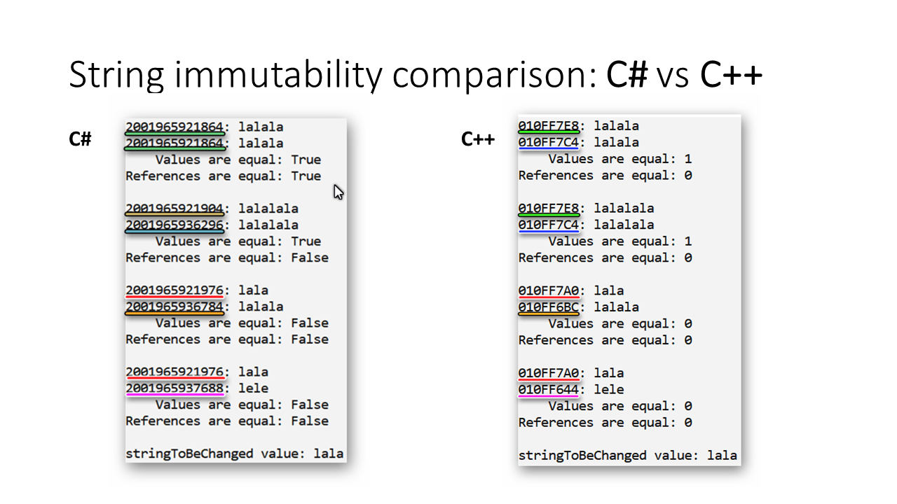

# `string` immutability: `C#` vs `C++`
In this repo I am trying to show how `string` type differs between `C#` and `C++` when we talk about immutability. If you want to see the difference, please check 2 files of the repo: 
[C# code](CSharpSamples/Program.cs) 
[C++ code](CppSamples/CppSamples.cpp) 
# How to get object's reference in `C#`?
In `C#` it is not recommended to work with `references` and `pointers` in your everyday work. Therefore I had to find a special way of displaying reference address. I was inspired by [this Stack Overflow answer](https://stackoverflow.com/a/10861731/13721565). I wrote a code similar to the first approach described in the answer and wrapped it in an <a href="https://github.com/edwardzieminski/String-immutability-test-CSharp-vs-Cpp/blob/master/CSharpSamples/RefHelper.cs">extension method</a> of `object` type, so you can get a reference as a `string` calling a method `Ref()` on any possible object. **Please note that this approach is unsafe!!** It also requires to enable unsafe code in the project. I used this only for demo purposes, but I would never used this in production code - I also do not recommend this to you.
# What should I look at?
If you want to understand the difference between `C#` and `C++` using my samples, please take a look at the source code, but also at the results (if you do not want to compile - below you will find screenshots from both `C#` and `C++`. Please focus not only on values and comparisons withon one test, but also please pay attention to how references change after each test.
# Results

# Take-aways
* `C++`: reference is 'attached' to a string variable. If you change a value of a string variable - the reference remains the same, the value changes.
* `C#`: reference is 'attached' to string value, but not always! But the compiler seems to try achieve some performance optimization by attaching variables with the same value to the same memory address.
* `C#`: If you assign the same string value to 2 separate variables - both variables will get the same reference. But as you can see in my samples - sometimes you may face a situation in which you have 2 string objects with the same value, but with different reference.
* `C#`: If you change a value of a string variable - new string object is going to be created and variable is going to be reattached to this new object.
* `C#`: Even though in C# `string` is a `reference type`, it acts as `value type` - i.e. `string.Replace(...)` method does not modify the object on which the method is called. It *returns* a new string object instead.
